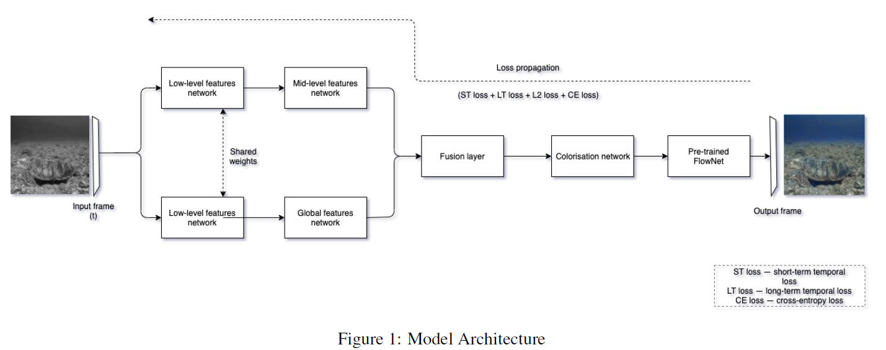
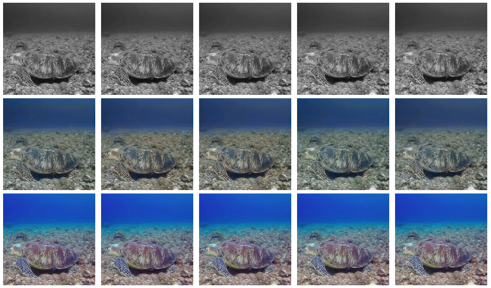
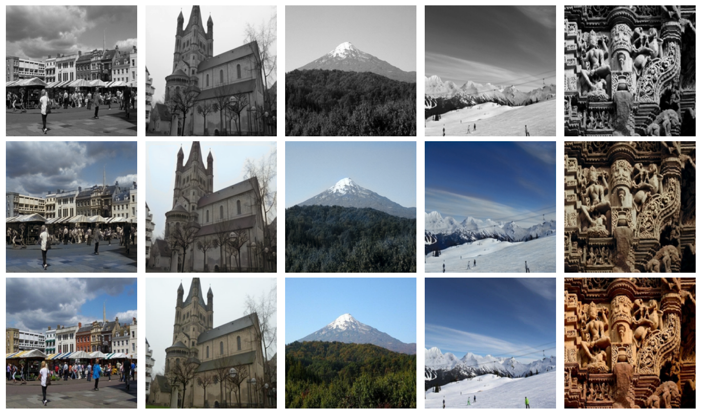

# Colorization-of-Video-using-Deep-Learning

Colorization of grayscale videos using a deep learning
model consists of two major stages — the colorization of
individual frames of the video, and ensuring temporal consistency
between the frames to eliminate flickering issues.
The model presented in this paper largely uses the local
and global features of each frame to obtain the best colorized
results. To account for temporal consistency, we introduce
short-term temporal loss and long-term temporal
loss. As a result of this, two principal requirements are satisfied.
Firstly, the quality of colorization on each frame is
rich, natural and deep. Secondly, the transition between
each frame is smooth and temporally stable.

# Architecture and Pipeline

This architecture is a Convolutional Neural Network with emphasis
on local and global features of the image. Local features
include ones specific to small patches in the image which
represent local texture or object, while global features represent
the overarching theme of the image. The second part of
the model focuses entirely on ensuring coherency between
each frame of the input video and preserving optical flow.

#Results
Qualitatively, we can see colored video
frames which are realistic and vibrant, and elimination of
flicker in the final video. The observation from these results
is that datasets related to places and landscapes performed
well, since our training data was primarily focused
on places. The poor images in Figure 2 corresponds to the
fact that training data didn’t have broader range of images.
But we see that temporal consistency between frames is
maintained even in the poor results.

### Note: The model has been trained only for 1 epoch
# Results 

Figure 1: Frame-wise Results (First row is the grayscale input, second is the colored output, third is the ground truth).

# Poor results

Failure modes (First row is the grayscale input, second is the colored output, third is the ground truth)

